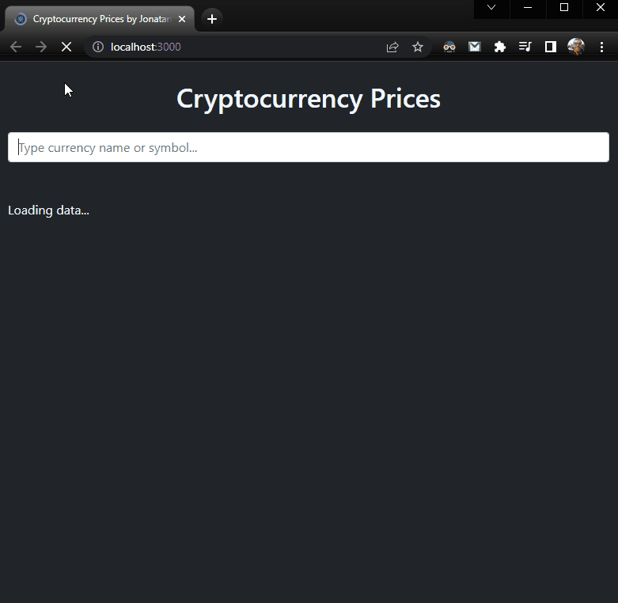

# Crypto Prices

React app that shows crypto currency prices by using CoinGecko API.

---

  

---

### Researched sites:

- https://stackoverflow.com/questions/42115110/how-can-i-change-the-scrollbar-style-in-bootstrap
- https://stackoverflow.com/questions/480735/select-all-contents-of-textbox-when-it-receives-focus-vanilla-js-or-jquery
- https://developer.mozilla.org/en-US/docs/Web/API/HTMLInputElement/setSelectionRange
- https://stackoverflow.com/questions/4067469/selecting-all-text-in-html-text-input-when-clicked

